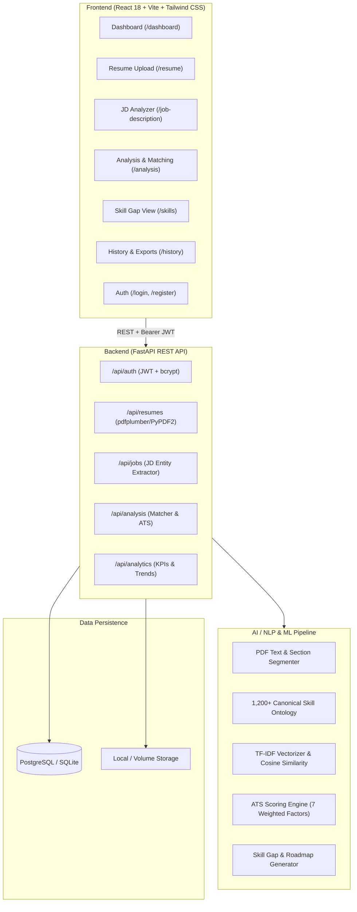
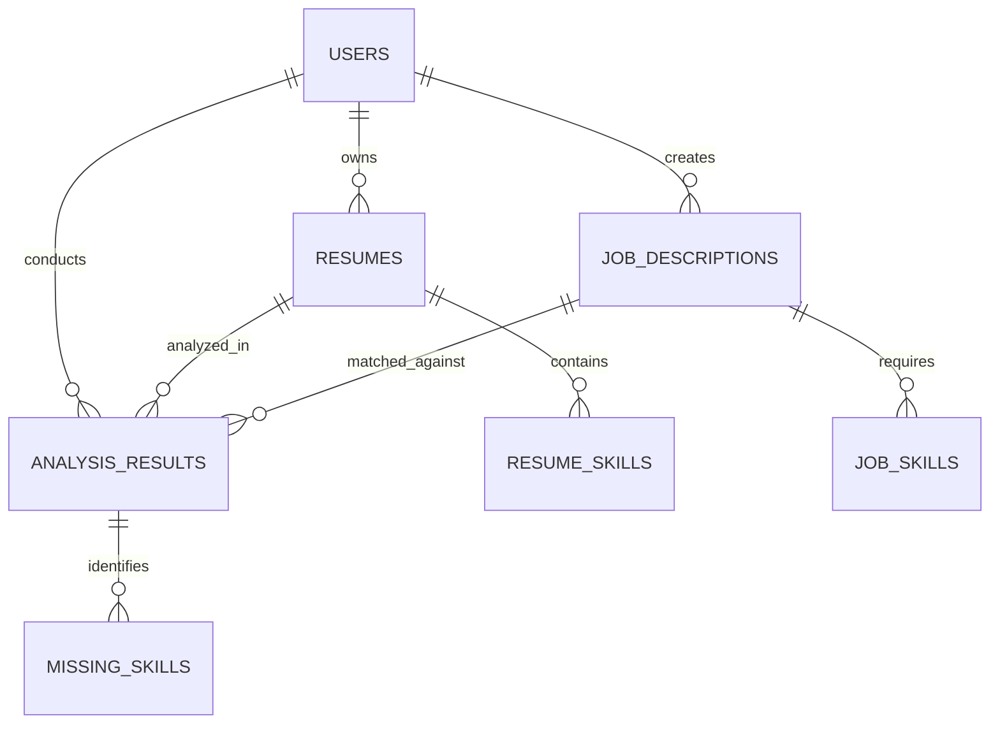

# 🚀 AI Resume Analyzer & Job Matcher (Production SaaS)

[](https://fastapi.tiangolo.com)
[](https://react.dev/)
[](https://tailwindcss.com/)
[](https://scikit-learn.org/)
[](https://www.postgresql.org/)
[](https://www.docker.com/)
[](https://docs.pytest.org/)

> **An enterprise-grade, portfolio-ready Full-Stack AI SaaS platform** combining React, FastAPI, Machine Learning (TF-IDF Vectorization & Cosine Similarity), 1,200+ skill ontologies, a 7-factor ATS scoring engine, and skill gap learning roadmap generation.

---

## 📌 Table of Contents
- [System Architecture](#-system-architecture)
- [Key Features](#-key-features)
- [Tech Stack](#-tech-stack)
- [Project Directory Structure](#-project-directory-structure)
- [Machine Learning & Matching Methodology](#-machine-learning--matching-methodology)
- [7-Factor ATS Scoring Algorithm](#-7-factor-ats-scoring-algorithm)
- [Database Schema (3NF)](#-database-schema-3nf)
- [FastAPI REST API Specification](#-fastapi-rest-api-specification)
- [📖 How to Use FastAPI Interactive Swagger UI (/docs)](#-how-to-use-fastapi-interactive-swagger-ui-docs)
- [Step-by-Step Setup & Run Guide](#-step-by-step-setup--run-guide)
  - [Prerequisites & Node.js Setup](#prerequisites--nodejs-setup)
  - [Method 1: Local Development (Quick Start)](#method-1-local-development-quick-start)
  - [Method 2: Docker Compose (Full Stack + PostgreSQL)](#method-2-docker-compose-full-stack--postgresql)
- [Running Automated Tests](#-running-automated-tests)
- [Portfolio & Interview Pack](#-portfolio--interview-pack)
  - [3 Resume Bullet Points](#3-resume-bullet-points)
  - [10 Technical Interview Questions & Answers](#10-technical-interview-questions--answers)
  - [Project Explanation for Interviews](#project-explanation-for-interviews)

---

## 🏗️ System Architecture



---

## ✨ Key Features

1. **Robust PDF Ingestion & NLP Information Extraction**:
   - Parses multi-column and single-column PDF resumes using `pdfplumber` with `pypdf` fallback.
   - Heuristic and regex extraction for Candidate Name, Email, Phone, Degrees, Graduation Years, and Work History.
2. **Comprehensive 1,200+ Skill Ontology**:
   - Maps technical skills across Programming Languages, Frontend, Backend, Databases, Cloud & DevOps, ML/AI, Testing, and Methodologies.
   - Multi-word N-gram matching with alias resolution (e.g. `k8s` -> `Kubernetes`, `postgres` -> `PostgreSQL`).
3. **TF-IDF & Cosine Similarity Matching**:
   - Sublinear term-frequency vectorization with bi-gram n-gram ranges.
   - Multi-factor weighted composite scoring (Skill Overlap, Semantic Cosine Similarity, Experience Calibration, Education Alignment).
4. **7-Factor Circular ATS Compliance Scorer**:
   - Assesses Keyword Coverage, Section Completeness, Contact Details, Measurable KPIs (`%`, `$`, `x`), Length/Format Health, Action Verbs, and Skill Relevance.
5. **Actionable Skill Gap & Learning Roadmap**:
   - Classifies missing competencies by priority (`High`, `Medium`, `Low`) with technical rationales, suggested learning milestones, and official tutorial links.
6. **Modern SaaS UI & Interactive Analytics**:
   - Dark/Slate enterprise design system with Tailwind CSS.
   - Recharts visual charts (Match & ATS score trends, Skill category distributions, Frequent gap radars).
   - 10 application routes with JWT authentication guards and 1-Click Demo Login.
7. **Report Exporting & Analytics History**:
   - Stores all previous evaluations in PostgreSQL.
   - One-click JSON and summary report downloads.

---

## 🛠️ Tech Stack

| Domain | Technologies Used |
|---|---|
| **Frontend** | React 18, Vite, Tailwind CSS, React Router v6, Axios, Recharts, Lucide React |
| **Backend** | Python 3.11, FastAPI, Pydantic v2, SQLAlchemy 2.0, Uvicorn |
| **Security** | JWT (HS256 Bearer Tokens), Native `bcrypt` 12-round salt hashing |
| **NLP / ML** | Scikit-learn (`TfidfVectorizer`, `cosine_similarity`), NumPy, Pandas, `pdfplumber`, `pypdf` |
| **Database** | PostgreSQL 15 (Production & Docker), SQLite (Local Zero-Config Standalone) |
| **DevOps & Testing**| Docker, Docker Compose, PyTest, Nginx Alpine Multi-stage builds |

---

## 📂 Project Directory Structure

```
ai-resume-analyzer/
├── frontend/
│   ├── public/
│   ├── src/
│   │   ├── components/
│   │   │   ├── common/        # Card, Badge, Button, CircularProgress, Modal, Spinner
│   │   │   └── charts/        # ScoreTrendChart, SkillDistributionChart, MissingSkillsChart
│   │   ├── context/           # AuthContext (JWT session), ToastContext
│   │   ├── layouts/           # DashboardLayout (Sidebar, Topbar)
│   │   ├── pages/             # Landing, Login, Register, Dashboard, Resume, JD, Analysis, Skills, History, Profile
│   │   ├── services/          # Axios API client with Bearer interceptors
│   │   ├── App.jsx            # React Router with ProtectedRoute guards
│   │   ├── index.css          # Tailwind CSS design system & glassmorphism
│   │   └── main.jsx
│   ├── package.json
│   ├── vite.config.js
│   └── tailwind.config.js
│
├── backend/
│   ├── app/
│   │   ├── api/               # auth, resumes, jobs, analysis, analytics
│   │   ├── database/          # SQLAlchemy connection & Base
│   │   ├── models/            # User, Resume, ResumeSkill, JobDescription, JobSkill, AnalysisResult, MissingSkill
│   │   ├── schemas/           # Pydantic v2 validation models
│   │   ├── ml/                # resume_parser, jd_analyzer, matcher, ats_scorer, skill_ontology, roadmap_generator
│   │   ├── services/          # auth_service, resume_service, analysis_service
│   │   ├── utils/             # security (bcrypt + JWT), text cleaner
│   │   ├── config.py          # Pydantic Settings
│   │   └── main.py            # FastAPI entrypoint
│   ├── tests/                 # pytest test suite
│   ├── requirements.txt
│   └── .env.example
│
├── sample_data/               # Sample PDF resumes & text job descriptions
├── docker-compose.yml
├── Dockerfile.backend
├── Dockerfile.frontend
├── README.md
└── .gitignore
```

---

## 🧠 Machine Learning & Matching Methodology

The matching engine computes a multi-dimensional composite score based on:

$$\text{Overall Match Score} = (0.40 \times S) + (0.30 \times C) + (0.15 \times E_{xp}) + (0.15 \times E_{du})$$

Where:
- **$S$ (Skill Match %)**: Exact and ontology-mapped intersection between resume skills and job requirements:
  $$S = \frac{|\text{Resume Skills} \cap \text{Job Skills}|}{|\text{Job Skills}|} \times 100$$
- **$C$ (TF-IDF Cosine Similarity %)**: Semantic similarity of bi-gram TF-IDF vectors:
  $$C = \frac{\mathbf{v}_{\text{resume}} \cdot \mathbf{v}_{\text{jd}}}{\|\mathbf{v}_{\text{resume}}\| \|\mathbf{v}_{\text{jd}}\|} \times 100$$
- **$E_{xp}$ (Experience Calibration %)**: Alignment of candidate career duration with JD seniority.
- **$E_{du}$ (Education Alignment %)**: Verification of requested degree credentials (e.g. BS in CS, MS, PhD).

---

## 🎯 7-Factor ATS Scoring Algorithm

| Factor | Weight | Verification Criteria |
|---|---|---|
| **1. Keyword Coverage** | 25 pts | Ratio of prominent TF-IDF job keywords present in resume body |
| **2. Section Completeness** | 20 pts | Presence of standard sections: Summary, Skills, Experience, Education, Projects |
| **3. Contact Details** | 15 pts | Extraction of Candidate Name, verified Email, and Phone number |
| **4. Quantifiable Impact** | 15 pts | High-impact metric markers (`%`, `$`, `x`, `RPS`, `ms latency`) in bullet points |
| **5. Format & Length Health** | 15 pts | Word count optimization (350–1,100 words) avoiding parsing truncations |
| **6. Action Verbs Density** | 10 pts | Strong leadership action verbs (*Architected, Spearheaded, Engineered*) |
| **7. Skill Relevance** | Normalized | Role-specific tech ontology alignment |

---

## 🗄️ Database Schema (3NF)



---

## 🌐 FastAPI REST API Specification

Interactive Swagger UI documentation is available at `http://localhost:8000/docs`.

| Method | Endpoint | Description | Auth Required |
|---|---|---|---|
| `POST` | `/api/auth/register` | Register new user account | No |
| `POST` | `/api/auth/login` | Authenticate credentials & retrieve JWT | No |
| `GET` | `/api/auth/me` | Current authenticated candidate profile | Yes |
| `POST` | `/api/resumes/upload` | Upload & parse PDF resume into structured JSON | Yes |
| `GET` | `/api/resumes` | List all resumes uploaded by user | Yes |
| `GET` | `/api/resumes/{id}` | Get single resume extracted entities | Yes |
| `DELETE` | `/api/resumes/{id}` | Delete resume and related records | Yes |
| `POST` | `/api/jobs/analyze` | Parse job posting & extract required skills | Yes |
| `GET` | `/api/jobs` | List saved job postings | Yes |
| `POST` | `/api/analysis/match` | Run ML similarity match & 7-factor ATS audit | Yes |
| `GET` | `/api/analysis/history` | List historical match evaluations | Yes |
| `GET` | `/api/analysis/{id}` | Get full analysis report details | Yes |
| `GET` | `/api/analysis/{id}/export` | Download analysis report as JSON | Yes |
| `GET` | `/api/analytics/dashboard` | Dashboard KPIs, score trends, and skill gaps | Yes |

---

## 📖 How to Use FastAPI Interactive Swagger UI (`/docs`)

FastAPI generates an interactive **OpenAPI Swagger UI** at **`http://127.0.0.1:8000/docs`** (and an alternative **ReDoc** interface at **`http://127.0.0.1:8000/redoc`**).

You can test all REST endpoints directly in your browser without writing code or using external tools:

### Step 1: Open Swagger UI
1. Ensure the backend server is running (`uvicorn app.main:app --host 127.0.0.1 --port 8000 --reload`).
2. Open your browser and navigate to: **`http://127.0.0.1:8000/docs`**.

### Step 2: Register or Log In to Obtain a JWT Bearer Token
1. Expand the **`POST /api/auth/register`** (or **`POST /api/auth/login`**) endpoint.
2. Click **"Try it out"** on the right side.
3. Paste the following JSON request body:
   ```json
   {
     "email": "demo.candidate@resumematcher.ai",
     "password": "DemoPassword123!",
     "full_name": "Alex Morgan"
   }
   ```
4. Click the blue **"Execute"** button.
5. In the response body below, copy the string value inside `"access_token"`.

### Step 3: Authorize Swagger with Your JWT Token
1. Scroll to the top right of the Swagger page and click the green **"Authorize"** 🔓 button.
2. Under `HTTPBearer (http, Bearer)`, paste your copied token into the **Value** input field.
3. Click **"Authorize"**, then click **"Close"**.
4. *(All locked endpoint icons will now turn closed 🔒, meaning all your Swagger requests will automatically send the `Authorization: Bearer <token>` header).*

### Step 4: Test PDF Resume Upload (`POST /api/resumes/upload`)
1. Expand **`POST /api/resumes/upload`** $\rightarrow$ Click **"Try it out"**.
2. Under the `file` field, click **"Choose File"** and select:
   `sample_data/sample_resume_senior_fullstack.pdf` (or any PDF resume).
3. Click **"Execute"**.
4. **Response**: You will receive HTTP 201 with extracted candidate name, contact details, parsed education, experience, and the list of identified skills. Copy the `"id"` (resume ID).

### Step 5: Test Job Description Analysis (`POST /api/jobs/analyze`)
1. Expand **`POST /api/jobs/analyze`** $\rightarrow$ Click **"Try it out"**.
2. Paste the JSON payload:
   ```json
   {
     "title": "Senior Full-Stack Engineer",
     "company": "StripeTech Innovations",
     "job_description_text": "We are seeking a Senior Full-Stack Engineer with strong experience in Python, FastAPI, React, PostgreSQL, Docker, and Redis. AWS and Kubernetes experience is preferred."
   }
   ```
3. Click **"Execute"**.
4. **Response**: HTTP 201 returning separated `required_skills`, `preferred_skills`, and `important_keywords`. Copy the `"id"` (job ID).

### Step 6: Test Match & 7-Factor ATS Audit (`POST /api/analysis/match`)
1. Expand **`POST /api/analysis/match`** $\rightarrow$ Click **"Try it out"**.
2. Provide the `resume_id` and `job_description_id` from the previous steps:
   ```json
   {
     "resume_id": "<PASTE_RESUME_ID_HERE>",
     "job_description_id": "<PASTE_JOB_ID_HERE>"
   }
   ```
3. Click **"Execute"**.
4. **Response**: Returns the composite `overall_match_score`, `skill_match_score`, `ats_score`, `matching_skills`, and the `missing_skills` array with priority rankings and learning roadmap suggestions.

### Step 7: Test Dashboard Analytics & Report Export
- **`GET /api/analytics/dashboard`**: Returns aggregated KPIs, match trends, and category distributions.
- **`GET /api/analysis/{id}/export`**: Enter your `analysis_id` and click **"Execute"** to download the structured evaluation report as a JSON file.

---

## 🚀 Step-by-Step Setup & Run Guide

### Prerequisites & Node.js Setup
- **Python 3.10+** (Verify with `python --version`)
- **Node.js 18+** & **npm** (Verify with `node -v` and `npm -v`)
  - *If Node.js is not on your PATH, it is installed in: `C:\Users\Anuja Itankar\AppData\Local\Programs\nodejs`*
- *(Optional)* **Docker & Docker Compose** for containerized execution

---

### Method 1: Local Development (Quick Start)

#### Step 1: Open Terminal in the Project Root
```bash
cd "C:\Users\Anuja Itankar\Desktop\Resume-Analyser"
```

#### Step 2: Start the FastAPI Backend Server
Open **Terminal 1**:
```powershell
cd backend
pip install -r requirements.txt
python -m uvicorn app.main:app --host 127.0.0.1 --port 8000 --reload
```
*Backend is now running at: `http://127.0.0.1:8000`*
*Interactive Swagger UI: `http://127.0.0.1:8000/docs`*

#### Step 3: Start the React Frontend Server
Open **Terminal 2**:
```powershell
cd frontend
npm install
npm run dev
```
*Frontend SaaS Dashboard is now running at: `http://localhost:5173`*

#### Step 4: Open in Browser & Test Full SaaS Workflow
1. Navigate to **`http://localhost:5173`**.
2. Click **"Sign In"** $\rightarrow$ Click **"1-Click Demo Login"** (instantly logs into demo profile).
3. Go to **Resume Upload**:
   - Drag & drop `sample_data/sample_resume_senior_fullstack.pdf` (or upload your own PDF).
   - Inspect extracted contacts, degrees, and skill badges.
4. Go to **Job Description**:
   - Click **"Quick Samples: Full-Stack"** $\rightarrow$ Click **"Analyze Job Requirements"**.
5. Go to **Match Analysis**:
   - Click **"Re-Calculate Match"** to view your **Overall Match Score**, **Circular ATS Compliance Chart**, **Matching vs. Missing Skills**, and the **Personalized Learning Roadmap**.

---

### Method 2: Docker Compose (Full Stack + PostgreSQL)

To spin up PostgreSQL 15, FastAPI, and React in isolated production containers:

```bash
docker-compose up --build
```

- **React Web Application**: `http://localhost:3000`
- **FastAPI REST API & Swagger Docs**: `http://localhost:8000/docs`
- **PostgreSQL Database**: `localhost:5432`
- **FastAPI REST API & Docs**: `http://localhost:8000/docs`
- **PostgreSQL Database**: `localhost:5432`

---

## 🧪 Running Automated Tests

Run the full pytest suite for authentication, PDF parsing, TF-IDF matcher, and ATS scoring:

```bash
cd backend
pytest tests/ -v
```

Output:
```
tests/test_ats.py::test_ats_scorer PASSED               [ 16%]
tests/test_auth.py::test_register_and_login PASSED      [ 33%]
tests/test_auth.py::test_invalid_login PASSED           [ 50%]
tests/test_matcher.py::test_matching_algorithm PASSED   [ 66%]
tests/test_parser.py::test_entity_extraction_from_text  [ 83%]
tests/test_parser.py::test_jd_analyzer PASSED           [100%]

======================== 6 passed in 0.98s =========================
```

---

## 💼 Portfolio & Interview Pack

### 3 Resume Bullet Points

- **Full-Stack AI Resume Matcher & ATS Intelligence Platform**: Built a production SaaS application using FastAPI, React 18, Tailwind CSS, and PostgreSQL to automate candidate resume parsing and job description compatibility analysis.
- **NLP Vector Similarity & Skill Ontology Engine**: Engineered a multi-factor matching pipeline using Scikit-Learn TF-IDF bi-gram vectorization and Cosine Similarity mapped against 1,200+ technical skill ontologies, generating transparent sub-second match scoring.
- **7-Factor ATS Compliance & Skill Gap Roadmap**: Designed an ATS audit algorithm evaluating keyword density, section health, and quantifiable metrics, coupled with an automated skill gap learning roadmap providing prioritized technical milestones.

---

### 10 Technical Interview Questions & Answers

#### 1. Why did you choose TF-IDF and Cosine Similarity over simple keyword matching?
> **Answer**: Simple keyword matching only counts keyword occurrences without accounting for term importance across the document corpus. TF-IDF penalizes common filler words while amplifying rare, domain-specific technical terms. Cosine similarity measures the cosine of the angle between the two multidimensional term vectors, making the score invariant to document length differences between a 1-page resume and a long job posting.

#### 2. How does your ATS scoring algorithm handle quantifiable metrics and action verbs?
> **Answer**: The ATS engine implements targeted regex analyzers that detect metric patterns (e.g. percentages, dollar figures, latency metrics like `ms/RPS`, and multipliers like `3x`) and matches words against a curated set of strong action verbs (*Architected, Spearheaded, Refactored*). Resumes containing 5+ distinct metric indicators and active voice receive maximum ATS points.

#### 3. How do you prevent SQL injection and secure password storage?
> **Answer**: All database interactions use SQLAlchemy ORM parameterized queries. Passwords are never stored in plaintext; they are hashed with `bcrypt` using 12 salt rounds. API endpoints enforce JWT HS256 Bearer authentication with token expiration.

#### 4. How did you structure the skill ontology to handle multi-word keywords and aliases?
> **Answer**: We built an inverted canonical index sorted by token length in descending order. This ensures multi-word phrases like `Machine Learning` or `Tailwind CSS` are matched before single tokens like `CSS`, avoiding substring collisions. Common aliases (e.g., `k8s` for `Kubernetes`, `postgres` for `PostgreSQL`) are normalized to their canonical form.

#### 5. Why use FastAPI instead of Flask or Django?
> **Answer**: FastAPI is built on Starlette and Pydantic, offering native asynchronous (`async/await`) concurrency, high performance matching NodeJS/Go, automatic type validation, and auto-generated Swagger/OpenAPI documentation without boilerplate.

#### 6. What happens if a PDF resume contains multi-column layouts or images?
> **Answer**: We use `pdfplumber` for layout-aware PDF text extraction, preserving spatial flow across columns. As a fallback, `pypdf` is used. If a document contains non-scannable raster images, the parser flags a 400 Bad Request indicating the document requires OCR or ATS-readable text.

#### 7. How is the composite Overall Match Score formulated?
> **Answer**: It uses a weighted formula: 40% exact and ontology-mapped Skill Overlap, 30% NLP TF-IDF Cosine Similarity, 15% Experience Level calibration, and 15% Education credential alignment.

#### 8. How did you design the React state management and UI architecture?
> **Answer**: We used React Context for global auth session management and toast notifications, combined with local state and custom hooks for API calls. Axios request/response interceptors automatically attach JWT bearer tokens and handle 401 token expirations globally.

#### 9. How do you ensure high performance when calculating similarity for large text?
> **Answer**: Text is preprocessed with stopword filtering and token normalization prior to vectorization. Scikit-learn's `TfidfVectorizer` operates on sparse matrix representations with `max_features=5000`, enabling sub-50ms execution times.

#### 10. How is this system deployed to production?
> **Answer**: The project is containerized with multi-stage Docker builds: the React frontend is compiled and served via Nginx Alpine, the FastAPI backend runs on Python 3.11-slim, and PostgreSQL runs with persistent healthchecks and Docker Compose orchestration.

---

### Project Explanation for Interviews (2-Minute Pitch)

> *"I built **ResumeAI**, a full-stack AI Resume Analyzer and Job Matcher that bridges the gap between candidate resumes and job postings. On the backend, I used **FastAPI, SQLAlchemy, and PostgreSQL** to power a high-performance REST API. For the intelligence layer, I implemented an NLP engine using **Scikit-learn TF-IDF vectorization and Cosine Similarity** alongside a dictionary of **1,200+ technical skill ontologies**.*
> 
> *The system extracts structured entities from uploaded PDF resumes, analyzes job descriptions, and calculates a transparent composite match score. It features a **7-factor ATS scoring engine** that evaluates keyword density, quantifiable KPIs, and section health, as well as an automated **Skill Gap Roadmap** that gives candidates actionable learning milestones for missing skills.*
> 
> *On the frontend, I built a modern SaaS dashboard with **React, Vite, and Tailwind CSS**, featuring interactive **Recharts** visualizations and circular progress gauges. The entire stack is fully tested with Pytest and containerized using **Docker Compose**."*

---

## 📄 License
MIT License © 2026 AI Resume Analyzer Platform
================================================
